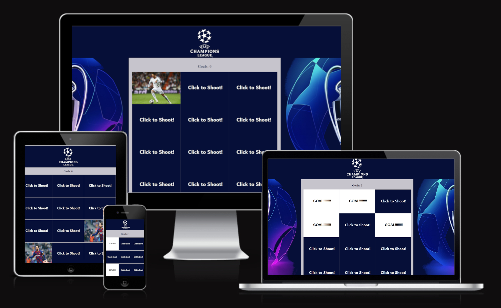
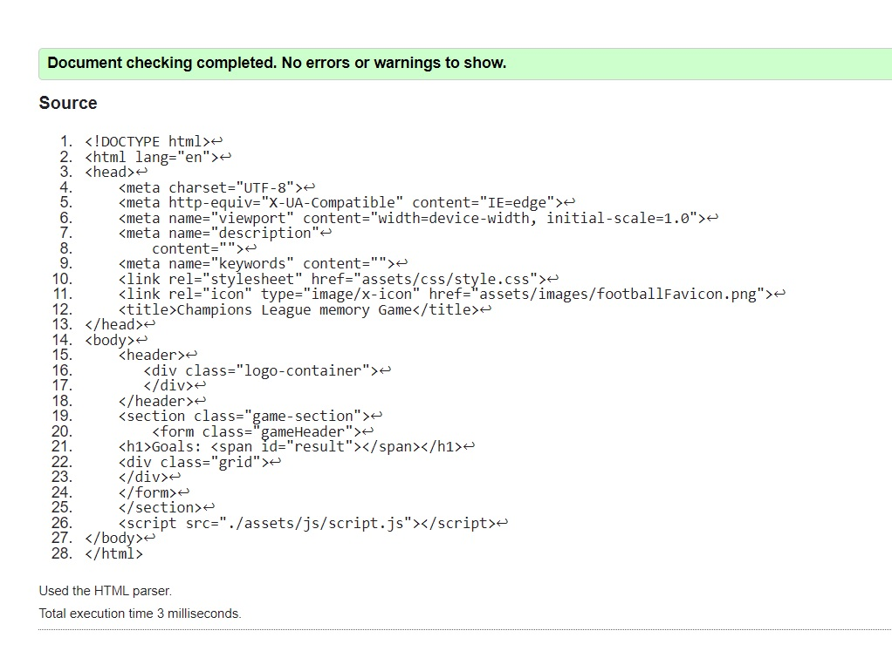
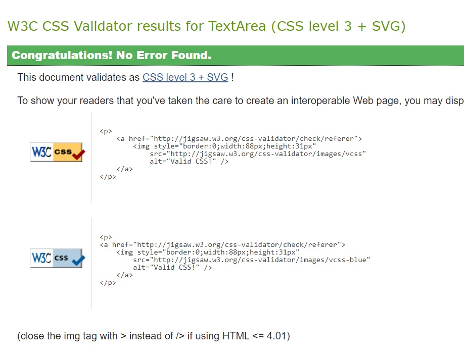
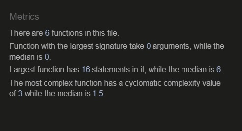

<h1 align="center">Champions League Memory Game!</h1>
<h2 align="center">The world's greatest club competition</h2>

This is a memory match game based on Players from the UEFA Champions League. The player challenges their memory by pairing up cards featuring hidden champions from the league by flipping over the cards on the board. The game ends when all champions have been successfully matched.

<h4 align="center"></h4>

Kick-Off here [here.](https://8000-paulnolan90-p2footballm-1xm5pzsmyop.ws-eu85.gitpod.io/)

## Features

- ### Executed:
    - The main section of the screen layout is dedicated to the game play area.
    - I have altered the background picture to match the game's color scheme and depict the UEFA Champions League trophy.
    - Score(matches) show above game.
    - Game automatically restarts when completed (delay of 5 seconds implemented).

- ### Possible Future features:
    - Sound - Improve the user experience by adding audio enhancements.
    - Share your score - Establish a score-sharing link to attract new users and facilitate sharing with friends.

## User Experience (UX) 
- ### User Stories
    - To engage in a memory test game by pairing up identical images.
    - Feedback to confirm each matching pair made and the matched images to change image so I dont play the same card twice.
    - To view my score. 
    - Confirmation that the game is completed.
    - Compatibility with multiple devices such as laptops, mobile phones, and tablets for gaming.
    - I anticipate receiving confirmation for each successful match and for the matched images to be displayed.

- ### Design
    - ### Colour scheme:
        - The colors I selected were chosen to align with the colors of the UEFA Champions League to maintain consistency with the overall theme of the game.
    - ### Typography:
        - Google Fonts - [Roboto](https://fonts.google.com/specimen/Roboto?preview.text=robot&preview.text_type=custom)

## Technologies used

- ### Languages:
    - Javascript
    - CSS 
    - HTML

- ### Frameworks and Tools:
    - Google Fonts - [Roboto](https://fonts.google.com/specimen/Roboto?preview.text=robot&preview.text_type=custom)
    - GIMP image editing software
    - Paint -  to edit image files
    - Git
    - GitHub
## Testing

Throughout the development and testing stages, I utilized the Chrome Developer Tool to mimic various viewport sizes, including desktop, laptop, tablet, and mobile views, to ensure the website's responsiveness and compatibility.

The deployed website underwent testing on Chrome, Edge, Firefox desktop browsers, as well as on mobile devices using the Chrome for Android browser.

- ### User stories' testing:
    - I would like to play a simple game to test my memory by matching up pairs of images
        - Memory match game uses Pokemon images to test the users memory - hidden images are arranged at random and change position each time the game is loaded
    - I expect feedback to confirm each matching pair made and the matched images remain on show
        - sound effects play at game load stage, with each card turn-over, with each non-successful and successful matching, and successful game completion. Matched image pairs remain on show
    - I expect to see my score
        - score is displayed below the game grid
    - I expect confirmation that I have completed the game successfully
        - on successful game completion, a sound is played and a pop-up modal appears with a congratulaions message
    - I would like the option to restart/replay the game 
        - a button appears below the game grid giving the player the option to restart. This presents a pop-up with a yes/no confirmation option. There is also a replay button within the game completion pop-up modal
    - I expect to be able to play on different devices (laptop, mobile and tablet)
        - the game was tested, and works, on desktop/laptop, tablet and mobile
    - I expect to have fun! :)
        - I had fun! :)

### HTML Validation 

Home

    
    

### CSS Validation 

CSS

    
    

### JS Validation 

JS

    
    

- ### Additional testing:
    The game was efficiently executed on the following web browsers:

    - Google Chrome
    - Opera
    - Microsoft Edge

- ### Bugs
    - After finishing the excercise I had realised that I didnt deploy the code institute template, the site still fully works so I cannot see if this will have any effect.
    - /*jshint esversion: 6 */ added this to the script.js file to get rid of errors when tested on JSHint 

## Deployment
### Github Pages
The website was deployed using Github pages.

How to: 

  - In Github login and go to the correct repo. go into its settings.
  - Once in settings go to the "pages" page.
  - Select "Deploy from Branch".
  - Select "Main" and "root" in the branch options below.
  - After a few minutes you will get a message saying "Your site is live at https://paulnolan90.github.io/p1-scoutinggroup/"

## Credits

### Content:
- The skills acquired to build the game were got through this tutorial video.: [Learn JavaScript by Building 7 Games with Ania Kubów](https://www.youtube.com/watch?v=lhNdUVh3qCc&t=115s) 

- Javascript reload page after 5 seconds: [How to Reload Page after Specific Time (5 seconds) in JavaScript](https://www.codexworld.com/how-to/reload-page-after-specific-time-5-seconds-in-javascript/)

- How to get rid off errors in Java testing site: [Arrow function syntax error](https://stackoverflow.com/questions/42866159/arrow-function-syntax-is-only-available-in-es6-use-esversion-6)
 
### Media:
- Champions league logo [Free image website](https://freebiesupply.com/logos/uefa-champions-league-logo/)
- Messi Image [Messi ](https://www.google.com/search?q=messi+barcelona&rlz=1C1FKPE_enIE977IE977&sxsrf=AJOqlzWQRrjaakux6r4EG_7WQ8V1sLSFoQ:1675684168636&source=lnms&tbm=isch&sa=X&ved=2ahUKEwjAhYL96YD9AhWsSkEAHaajDYMQ_AUoAXoECAIQAw&biw=2048&bih=1034&dpr=1.25#imgrc=9P1NVGtrzisd6M)
- Ronaldo Image [Ronaldo ](https://www.liveabout.com/cristiano-ronaldo-3557502)
- De Bruyne Image [De Bruyne ](https://www.thetimes.co.uk/article/kevin-de-bruyne-reads-the-game-better-than-anyone-thats-why-he-has-so-much-time-g3vkts03n)
- Rashford Image [Rashford](https://www.beinsports.com/en/premier-league/news/rashford-can-improve-to-be-england-and-man-1/1620934)
- Neymar Image [Neymar](https://www.skysports.com/football/news/11820/12275119/neymar-and-kylian-mbappe-paris-saint-germain-president-nasser-al-khelaifi-says-pair-have-no-reason-to-leave)
- Mbappe Image [Mbappe](https://www.espn.com/soccer/uefa-champions-league/story/4594650/kylian-mbappe-boosts-psggives-real-madrid-glimpse-of-future-with-champions-league-heroics)
- Haaland Image [Haaland](https://www.bundesliga.com/en/bundesliga/news/erling-haaland-s-record-breaking-career-in-numbers-borussia-dortmund-norway-10065)
    